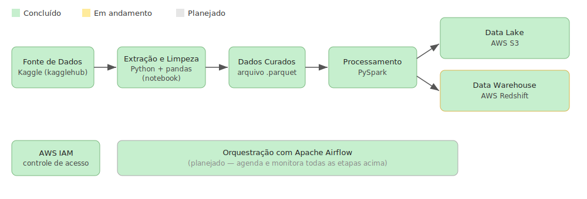

# Pipeline ETL para Score de Crédito

**Status geral: 🟡 Em andamento** | Bootcamp (Re)Start Data Girls | Trilha de Engenharia de Dados | 2026

Pipeline de dados para estruturar informações de clientes bancários, permitindo que equipes de Analytics e Crédito utilizem os dados em modelos de score de crédito e análise de risco.

Dataset de origem: [Credit Score Classification (Kaggle)](https://www.kaggle.com/datasets/parisrohan/credit-score-classification)

---

## Arquitetura do pipeline



O projeto está sendo construído em etapas. Abaixo, o status real de cada uma:

| Etapa | Descrição | Status |
|---|---|---|
| Extração | Coleta dos dados via `kagglehub` (train/test) | ✅ Concluído |
| Transformação | Limpeza, padronização de tipos, tratamento de outliers, imputação de nulos, one-hot encoding | ✅ Concluído |
| Armazenamento local | Exportação do dataset curado em `.parquet` | ✅ Concluído |
| Processamento distribuído | Reescrita/adaptação do pipeline em PySpark | ✅ Concluído |
| Data Lake | Armazenamento em AWS S3 | ✅ Concluído |
| Data Warehouse | Carga estruturada em AWS Redshift | 🟡 Em andamento |
| Orquestração | Automação e agendamento das etapas com Apache Airflow | 🔲 Planejado |
| Segurança/Acesso | Gestão de permissões via AWS IAM | ✅ Concluído |

> Este README é atualizado conforme o pipeline evolui. A versão atual cobre a **extração e limpeza dos dados em Python**, o **processamento em PySpark**, o **envio dos dados ao Data Lake (AWS S3)** e o **controle de acesso via AWS IAM**. A modelagem e carga no Data Warehouse (AWS Redshift) está em andamento.

---

## O que já foi feito

O pipeline foi dividido em dois scripts: [`extract.py`](extract.py) (extração e ingestão na camada raw) e [`transform.py`](transform.py) (limpeza, transformação e ingestão na camada curated).

### Pipeline
#### `extract.py` — Extração (camada raw)
- **Extração**: download do dataset do Kaggle via `kagglehub.dataset_download`.
- **Ingestão no Data Lake**: upload de todos os arquivos `.csv` encontrados para o bucket **AWS S3**, particionado por domínio e data (`raw/{domain}/dt={data}/`).
- **Rastreabilidade**: a data de extração (`dt`) é retornada pela função para ser reaproveitada pelas etapas seguintes do pipeline.

#### `transform.py` — Transformação (camada curated)
- **Extração**: carregamento dos conjuntos `train` e `test` diretamente do Kaggle com `kagglehub`, com até 3 retentativas automáticas (com backoff) em caso de falha.
- **Unificação**: concatenação dos dois conjuntos, com marcação de origem (`train`/`test`) e alinhamento de colunas (inclusão de `Credit_Score` vazio em `test` antes da junção).
- **Padronização**: renomeação de colunas para português, limpeza de espaços/underscores e normalização de valores nulos disfarçados (`"NM"`, `"!@9#%8"`, `"_______"`, etc.).
- **Tipagem**: conversão de colunas monetárias para `float` e de colunas de contagem para `Int64`.
- **Tratamento de outliers**: valores impossíveis (idade > 110, valores negativos, taxas fora do esperado, renda anual acima do limite via IQR) convertidos em nulos via regras de negócio.
- **Arredondamento**: padronização de casas decimais para colunas monetárias e para a taxa de utilização de crédito.
- **Engenharia de atributos**: conversão de `tempo de histórico de crédito` (texto "X Years and Y Months") para número de meses; one-hot encoding da coluna de tipos de empréstimo (`tipo_de_emprestimo`).
- **Imputação**: preenchimento de nulos por moda (dados do mesmo cliente, via `id_cliente`) e por mediana (variáveis numéricas contínuas), além de moda para variáveis categóricas.
- **Anonimização**: remoção das colunas `nome` e `seguro_social_ssn` antes da exportação final.
- **Exportação**: dataset final salvo em formato `.parquet` e enviado ao bucket S3 na camada `curated/{domain}/dt={data}/`.

### Infraestrutura
- **Processamento distribuído**: sessão **PySpark** inicializada via `spark_config.get_spark_session` (integração em andamento — as transformações atuais ainda rodam em `pandas`).
- **Data Lake**: leitura da camada raw (`s3a://{bucket}/raw/{domain}/dt={data}/`) e escrita da camada curated, ambas em **AWS S3**.
- **Segurança/Acesso**: controle de acesso configurado via AWS IAM e acesso ao S3 via `boto3`/cliente `s3` configurado em `config.py`. 


## Próximos passos

1. Modelar e carregar os dados no **Data Warehouse** (AWS Redshift) — *em andamento*.
2. Orquestrar todas as etapas com **Apache Airflow**.

## Stack

**Já utilizado:**
Python, pandas, numpy, kagglehub, PySpark, AWS (S3, IAM)

**Planejado para as próximas etapas:**
AWS Redshift, Apache Airflow

## Estrutura do repositório

Com a adição dos módulos de PySpark e AWS, a recomendação é organizar o código em pastas por responsabilidade, em vez de deixar tudo solto na raiz:

```
pipeline-etl-credito/
├── notebooks/
│   └── Credit_Score_Classification.ipynb
├── src/
│   ├── config/
│   │   ├── config.py          # cliente S3 (boto3)
│   │   └── spark_config.py    # sessão Spark configurada para o S3
│   └── etl/
│       ├── extract.py
│       ├── transform.py
│       └── load.py
├── imagens/
│   └── arquitetura.svg
├── main.py                    # ponto de entrada, orquestra extract → transform → load
├── .env.example
├── requirements.txt
└── README.md
```

**Por que essa organização:**

- **`src/config/`**: agrupa tudo relacionado a configuração e credenciais (cliente S3, sessão Spark), separado da lógica de negócio do ETL.
- **`src/etl/`**: agrupa as três etapas do pipeline (`extract.py`, `transform.py`, `load.py`), facilitando encontrar e testar cada uma isoladamente.
- **`main.py` na raiz**: continua sendo o ponto de entrada do projeto (`python main.py`), importando as funções de `src/etl` e `src/config`.
- **`.env.example`**: versiona as chaves esperadas (sem os valores reais) para facilitar a configuração de quem for rodar o projeto — o `.env` real continua fora do Git.
- **`requirements.txt`**: com `pyspark`, `boto3`, `python-dotenv` e demais dependências, para facilitar a instalação com `pip install -r requirements.txt`.

> Para que os imports funcionem (ex: `from src.etl.extract import ...`), adicione um arquivo `__init__.py` vazio em `src/`, `src/config/` e `src/etl/`.

